* Table of Contents
{:toc}

--------------------------------------------------------------------------------------------------------------------
## **Introduction**

### **Purpose**

This document specifies architecture and software design decisions for the application, CamNUS.
CamNUS (Continuous Assessment Manager NUS) is an application for Teaching Assistants to manage their classes and keep
track of the graded components of a module such as class participation, assignments and exams.

### **Scope**

This describes the software architecture and software design decisions for the implementation
of CamNUS. The intended audience of this document is the developers, designers, and
software testers of CamNUS.

### **Design Goals**

#### **Maintainability**

With a team of developers working on a project, it is important that developers are able to change one
component of the project without needing to change many components that other developers
may be working on.

--------------------------------------------------------------------------------------------------------------------
## **Acknowledgements**
* This project is based on the AddressBook-Level3 project created by the SE-EDU initiative.
* Libraries used: [**JavaFx**](https://openjfx.io/), [**Jackson**](https://github.com/FasterXML/jackson), [**JUnit5**](https://github.com/junit-team/junit5), [**PlantUML**](https://plantuml.com/)

--------------------------------------------------------------------------------------------------------------------

## **Setting up, getting started**

Refer to the guide [_Setting up and getting started_](SettingUp.md).

--------------------------------------------------------------------------------------------------------------------

## **Design**

:bulb: **Tip:** The `.puml` files used to create diagrams in this document can be found in the [diagrams](https://github.com/AY2122S2-CS2103T-W13-2/tp/blob/master/docs/diagrams/) folder. Refer to the [_PlantUML Tutorial_ at se-edu/guides](https://se-education.org/guides/tutorials/plantUml.html) to learn how to create and edit diagrams.

### Architecture

The ***Architecture Diagram*** given above explains the high-level design of the App.

Given below is a quick overview of main components and how they interact with each other.

**Main components of the architecture**

**`Main`** has two classes called [`Main`](https://github.com/AY2122S2-CS2103T-W13-2/tp/blob/master/src/main/java/seedu/address/Main.java) and [`MainApp`](https://github.com/AY2122S2-CS2103T-W13-2/tp/blob/master/src/main/java/seedu/address/MainApp.java). It is responsible for,
* At app launch: Initializes the components in the correct sequence, and connects them up with each other.
* At shut down: Shuts down the components and invokes cleanup methods where necessary.

[**`Commons`**](#common-classes) represents a collection of classes used by multiple other components.

The rest of the App consists of four components.

* [**`UI`**](#ui-component): The UI of the App.
* [**`Logic`**](#logic-component): The command executor.
* [**`Model`**](#model-component): Holds the data of the App in memory.
* [**`Storage`**](#storage-component): Reads data from, and writes data to, the hard disk.

**How the architecture components interact with each other**

The *Sequence Diagram* below shows how the components interact with each other for the scenario where the user issues the command `delete 1`.

Each of the four main components (also shown in the diagram above),

* defines its *API* in an `interface` with the same name as the Component.
* implements its functionality using a concrete `{Component Name}Manager` class (which follows the corresponding API `interface` mentioned in the previous point.

For example, the `Logic` component defines its API in the `Logic.java` interface and implements its functionality using the `LogicManager.java` class which follows the `Logic` interface. Other components interact with a given component through its interface rather than the concrete class (reason: to prevent outside component's being coupled to the implementation of a component), as illustrated in the (partial) class diagram below.

The sections below give more details of each component.

### UI component

The **API** of this component is specified in [`Ui.java`](https://github.com/AY2122S2-CS2103T-W13-2/tp/blob/master/src/main/java/seedu/address/ui/Ui.java)

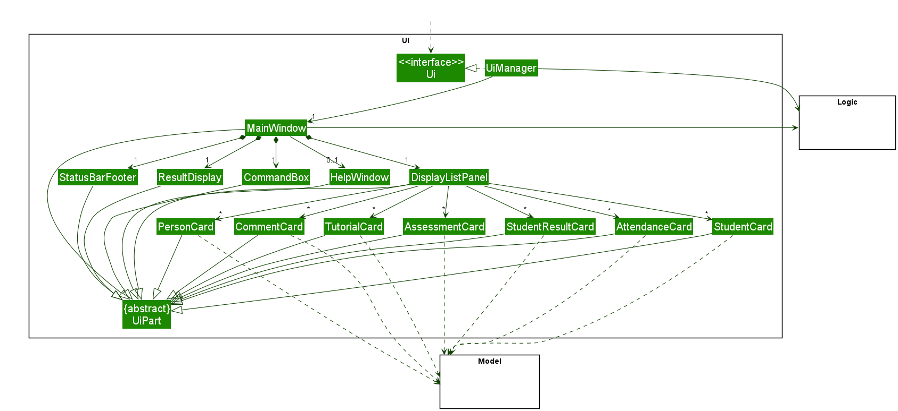

The UI consists of a `MainWindow` that is made up of parts e.g.`CommandBox`, `ResultDisplay`, `DisplayListPanel`, `StatusBarFooter` etc. All these, including the `MainWindow`, inherit from the abstract `UiPart` class which captures the commonalities between classes that represent parts of the visible GUI.

The `UI` component uses the JavaFx UI framework. The layout of these UI parts are defined in matching `.fxml` files that are in the `src/main/resources/view` folder. For example, the layout of the [`MainWindow`](https://github.com/AY2122S2-CS2103T-W13-2/tp/blob/master/src/main/java/seedu/address/ui/MainWindow.java) is specified in [`MainWindow.fxml`](https://github.com/AY2122S2-CS2103T-W13-2/tp/blob/master/src/main/resources/view/MainWindow.fxml)

The `UI` component,

* executes user commands using the `Logic` component.
* listens for changes to `Model` data so that the UI can be updated with the modified data.
* keeps a reference to the `Logic` component, because the `UI` relies on the `Logic` to execute commands.
* depends on some classes in the `Model` component, as it displays a list of `Displayable` objects residing in the `Model`.
* objects belonging to a class that implement the `Displayable` interface can be shown in the UI component
* Classes that implement `Displayable` are:
  1. `Person`
  2. `Student`
  3. `Tutorial`
  4. `Comment`
  5. `Attendance`
  6. `Assessment`
  7. `StudentResult`

### Logic component

**API** : [`Logic.java`](https://github.com/AY2122S2-CS2103T-W13-2/tp/blob/master/src/main/java/seedu/address/logic/Logic.java)

Here's a (partial) class diagram of the `Logic` component:

How the `Logic` component works:
1. When `Logic` is called upon to execute a command, it uses the `AddressBookParser` class to parse the user command.
1. This results in a `Command` object (more precisely, an object of one of its subclasses e.g., `AddCommand`) which is executed by the `LogicManager`.
1. The command can communicate with the `Model` when it is executed (e.g. to add a person).
1. The result of the command execution is encapsulated as a `CommandResult` object which is returned from `Logic`.

The Sequence Diagram below illustrates the interactions within the `Logic` component for the `execute("delete 1")` API call.

:information_source: **Note:** The lifeline for `DeleteCommandParser` should end at the destroy marker (X) but due to a limitation of PlantUML, the lifeline reaches the end of diagram.

Here are the other classes in `Logic` (omitted from the class diagram above) that are used for parsing a user command:

How the parsing works:
* When called upon to parse a user command, the `AddressBookParser` class creates an `XYZCommandParser` (`XYZ` is a placeholder for the specific command name e.g., `AddCommandParser`) which uses the other classes shown above to parse the user command and create a `XYZCommand` object (e.g., `AddCommand`) which the `AddressBookParser` returns back as a `Command` object.
* All `XYZCommandParser` classes (e.g., `AddCommandParser`, `DeleteCommandParser`, ...) inherit from the `Parser` interface so that they can be treated similarly where possible e.g, during testing.

### Model component
**API** : [`Model.java`](https://github.com/AY2122S2-CS2103T-W13-2/tp/blob/master/src/main/java/seedu/address/model/Model.java)

The `Model` component,

* stores the address book data i.e., all `Person` objects (which are contained in a `UniquePersonList` object), all `Assessment` objects (which are contained in a `UniqueAssessmentList`) and all `Tutorial` objects (which are stored in a `UniqueTutorialList`).
* stores the `Displayable` objects currently shown on the UI (e.g. results of user commands) as a separate _filtered_ list which is exposed to outsiders as an unmodifiable `ObservableList<Displayable>` that can be 'observed' (the Logic component uses this list to ensure that users enter index-related commands that are suitable for the objects being displayed).
* stores the currently 'selected' `Person` objects (e.g., results of a search query) as a separate _filtered_ list which is exposed to outsiders as an unmodifiable `ObservableList<Person>` that can be 'observed' e.g. the UI can be bound to this list so that the UI automatically updates when the data in the list change.
* stores the currently 'selected' `Tutorial` objects (e.g., results of a list command) as a separate _filtered_ list which is exposed to outsiders as an unmodifiable `FilteredList<Tutorial>` that can be 'observed'.
* stores all `Assessment` objects in a separate _filtered_ list which is exposed to outsiders as an unmodifiable `FilteredList<Assessment>` that can be 'observed'.
* stores 'selected' `Attendance`, `StudentResult` and `Comment` objects in separate _filtered_ lists to be used by the Logic component for related commands.
* stores a `UserPref` object that represents the user’s preferences. This is exposed to the outside as a `ReadOnlyUserPref` objects.
* does not depend on any of the other three components (as the `Model` represents data entities of the domain, they should make sense on their own without depending on other components)

:information_source: **Note:** An alternative (arguably, a more OOP) model is given below. It has a `Tag` list in the `AddressBook`, which `Person` references. This allows `AddressBook` to only require one `Tag` object per unique tag, instead of each `Person` needing their own `Tag` objects. 

### Storage component

**API** : [`Storage.java`](https://github.com/AY2122S2-CS2103T-W13-2/tp/blob/master/src/main/java/seedu/address/storage/Storage.java)

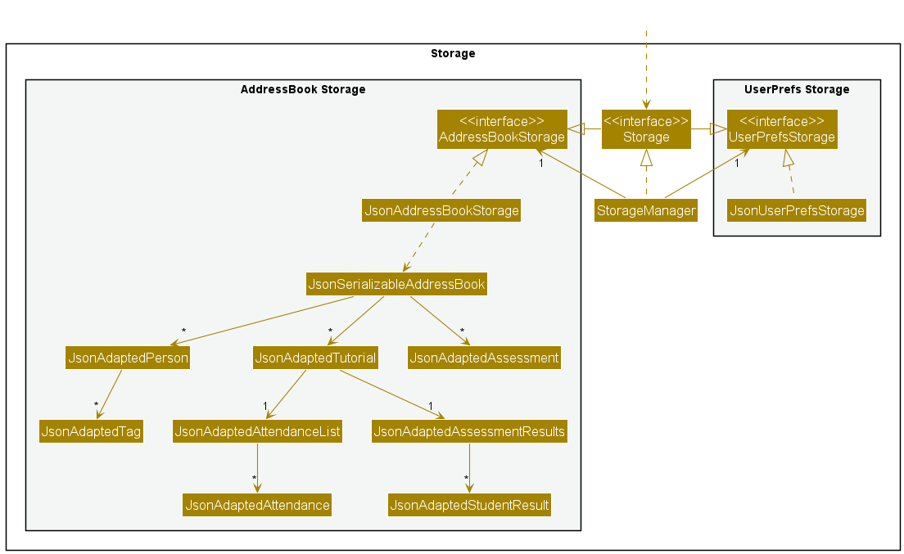

The `Storage` component,
* can save both address book data and user preference data in json format, and read them back into corresponding objects.
* inherits from both `AddressBookStorage` and `UserPrefStorage`, which means it can be treated as either one (if only the functionality of only one is needed).
* depends on some classes in the `Model` component (because the `Storage` component's job is to save/retrieve objects that belong to the `Model`)

### Common classes

Classes used by multiple components are in the `seedu.addressbook.commons` package.

--------------------------------------------------------------------------------------------------------------------

## **Implementation**

This section describes some noteworthy details on how certain features are implemented.

### Detailed Help Window feature
#### Implementation

This `HelpWindow` extends `AddressBook` with a detailed Help Window implementing the following operations:
* `HelpWindow#addIntroText()` —  Shows the user the introduction text of the application describing its purpose.
* `HelpWindow#addDevGuideText()` —  Shows the user a clickable hyperlink for the Developer Guide
* `HelpWindow#showCommands()` —  Shows the user a list of the commands present in camNUS, along with a detailed guide for each command.

These operations are exposed in the `HelpWindow` class as `HelpWindow#addIntroText()`, `HelpWindow#addDevGuideText()` and `HelpWindow#showCommands()` respectively.

Given below is an example usage scenario and how the Help Window behaves at each step.

Step 1. The user launches the application for the first time. A `HelpWindow` is created and initialized with the default `HelpWindow#addIntroText()` to show the user the introduction text. However, this `HelpWindow` is not shown until the user requests for it.

Step 2. The user executes `help` command to show the help window. The `help` command calls `MainWindow#handleHelp()`, causing the application to show the help window.

Step 3. The user clicks on the button `Commands` in the help window. This calls `HelpWindow#showCommands()`, causing the display pane containing the introduction text to be deleted, and a new display pane containing the list of command details to be added to the `HelpWindow`.

The following sequence diagram shows how this operation works:

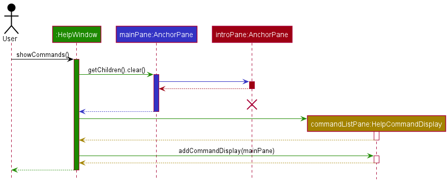

:information_source: **Note:** The lifeline for `introPane:AnchorPane` should end at the destroy marker (X) but due to a limitation of PlantUML, the lifeline reaches the end of diagram.

Step 4. After browsing through the list of commands, the user decides now that he/she wants to view the full Developer Guide for more explicit information. The user clicks on the button `Developer Guide` in the help window. This calls `HelpWindow#addDevGuideText()`, causing the display pane containing the command list to be deleted, and a new display pane containing the Developer Guide hyperlink to be added to the `HelpWindow`.

#### Design considerations:

**Aspect: How each button executes:**

* **Alternative 1 (current choice):** Deletes current display pane, creates new display pane.
    * Pros: Easy to implement. Low on memory usage.
    * Cons: If more graphic elements are added to enhance this feature, it may have performance issues in terms of performance usage.

* **Alternative 2:** Create persistent display panes for all 3 features: Introduction Text, Command List, and Developer Guide link. Show or hide them when required.
    * Pros: Faster performance, since no new objects are created after initialization.
    * Cons: Harder to implement, have to ensure that the display panes are correctly positioned and hidden/shown when required.

### Display Students Feature

#### Implementation

The display students feature is facilitated by the enhanced `MainWindow` of the `UI` component. It extends the application with a `DisplayListPanel` that could display a list of `Student` and `Tutorial`, other than `Person`, by implementing the following operations:

* `MainWindow#handlePerson()` — Shows the list of persons stored in the application.
* `MainWindow#handleClass()` — Shows the list of classes stored in the application.
* `MainWindow#handleStudent()` — Shows the list of students stored in the application.

These operations are exposed in the `MainWindow` class as `MainWindow#handlePerson()`, `MainWindow#handleClass()` and `MainWindow#handleStudent()` respectively.

Given below is an example usage scenario and how the mechanism behaves at each step.

Step 1. The user launches the application for the first time. The `MainWindow` will be initialized with the initial `DisplayListPanel` displaying the list of persons stored in the application.

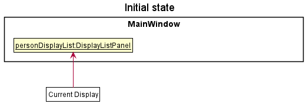

Step 2. The user inputs `list_class` command to see the list of classes. The `list_class` command calls `MainWindow#handleClass()`, causing the `DisplayListPanel` to be replaced with a new `DisplayListPanel` that displays the list of classes stored in the application.

Step 3. The user inputs `list_student 1` command to see the list of students in the first class of the previously displayed list. The `list_student` command calls `MainWindow#handleStudent()`, causing the `DisplayListPanel` to be replaced with a new `DisplayListPanel` that displays the list of students stored in the application that belong to the specified class .

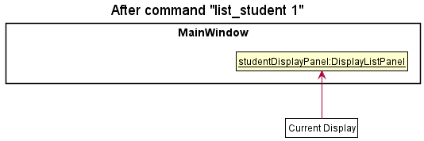

The following sequence diagram shows how the list operation works:

#### Design considerations:

**Aspect: How the panel displaying each list executes:**

* **Alternative 1 (current choice):** Replaces the current panel with a new panel in displaying a different type of list
    * Pros:
      * Easy to implement
      * Low on memory usage
      * Can accommodate a large variety in type of list as long as the contents implement the `Displayable` interface
    * Cons:
      * Requires more changes to the existing code, with the implementation of an interface and an enumeration
      * Additionally, the existing `Person` class will also need to be modified to implement the interface

* **Alternative 2:** Create multiple panels to display different lists
    * Pros:
      * Requires less modifications to existing code.
      * Shows every list available at a glance.
      * Does not require the user to key in commands to switch between lists.
    * Cons:
      * Difficulty in accommodating a larger variety of different lists with the implementation of more features in future
      * The UI can appear messy in the presence of multiple long lists

### Add Assessment Feature
#### Implementation
The `add_assessment` command is facilitated by the enhanced `AddressBook`. It extends the `model` package with an `Assessment` class and its field classes, `AssessmentName`, `Weightage` and `FullMark`. It also extends the `AddressBook` with the `assessments` field, which is a `UniqueAssessmentList`. It implements the following operations:
- `AddressBook#hasAssessment()` —  Checks if an assessment is present inside `assessments`.
- `AddressBook#addAssessment()` —  Adds an assessment to `assessments` if it is not already in the list.

These operations are exposed in the `Model` interface as `Model#hasAssessment()` and `Model#addAssessment()` respectively.

Given below is an example usage scenario and how `add_assessment` behaves at each step.

Step 1. The user launches the application for the first time. The `AddressBook` will be initialized with an empty `UniqueAssessmentList`. The `MainWindow` will be initialized with the initial `DisplayListPanel` displaying the list of persons stored in the application.

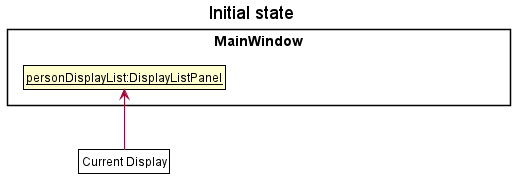

Step 2. The user inputs `add_assessment as/Test 1 w/10 w/10` to add an assessment to camNUS. The `assessments` list in the `AddressBook` will have an additional assessment. The updated list of assessments is displayed to the user in the `DisplayListPanel` in the `MainWindow`.

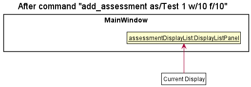

The following sequence diagram shows how the add assessment operation works:

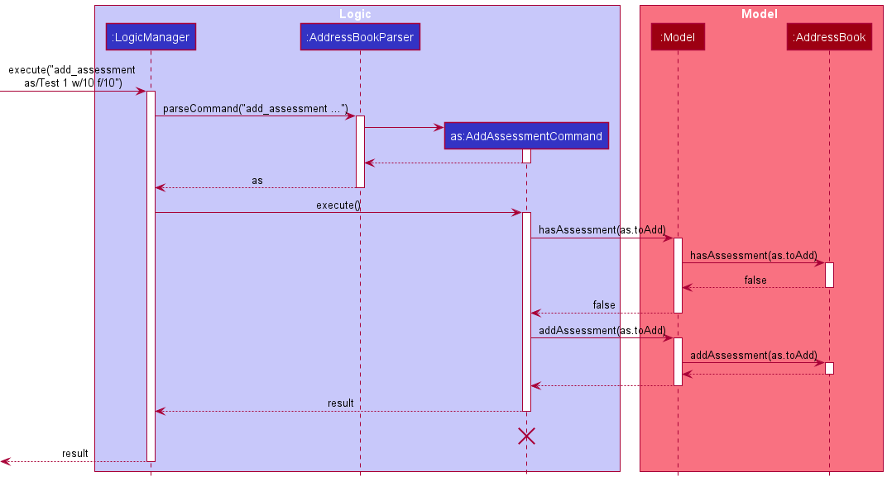

#### Design considerations
**Aspect: How assessments and student results are stored in the model:**

* **Alternative 1 (current choice):** assessments are stored as `Assessment` objects in the `AddressBook`'s `assessments` list. The student results for each assessment is stored inside an `AssessmentResults` object which is stored inside an `AssessmentResultsList` in each `Tutorial`.
    * Pros:
        * Can quickly display the list of results of a tutorial in an assessment, which is a useful feature for TAs.
        * High degree of abstraction may allow future changes in the implementation of assessment results and student result.
        * Does not require many changes to the existing code as the `AddressBook` class is simply updated with new fields to store the assessment and tutorial list.
    * Cons:
        * Code is not easy to understand.
        * Retrieving an individual student's result for an assessment may take slightly more time (as it requires searching the list of assessment results for the requested assessment and then searching the list of student results for the requested student). However, this is not a big concern as usually the number of assessments and the size of classes are not large in real life.

* **Alternative 2:** Each `Student` stores their own results. The `Tutorial` does not contain student results.
    * Pros:
        * Less hierarchical design - easier to understand code.
        * Can quickly display the results for all assessments of a student. However, this feature is deemed less important than displaying the results of all students in a class for a particular assessment, which helps TAs gauge the relative performance and needs of students.
    * Cons:
        * Displaying the list of results of a tutorial requires accessing each student and searching in their assessment results list. This may require more complex code and slow down performance as compared to Alternative 1.

### Add Student Feature

This `AddStudentCommand` feature is facilitated by display student feature. It extends the application implementing the
following operations:

* `AddStudentCommand#execute()` — Find corresponding `Person` and set it to a `Student`.

The operation is facilitated by the `Model` interface using `Model#addStudent()`,`Model#hasPersonWithName()`
, `Model#getPersonWithName()`, `Model#hasTutorialWithName()` and `Model#hasStudentWithName()`.

Given below is an example scenario and how the mechanism behaves at each step.

Step 1. The user executes `add n/B ...` to add a new`Person`. The new `PersonCard` with the corresponding populated details will be displayed on the
`DisplayListPanel` displaying the list of `Person` stored in the application.

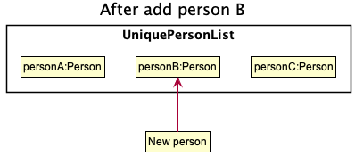

Step 2. The user executes `add_student n/C ...` command to add a student. The add_student command
call `Model#getPersonWithName()` is used to retrieve the corresponding `Person`.

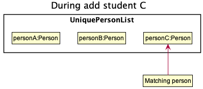

:information_source:**Note:** The add_student command call
`Model#hasPersonWithName()` and `Model#hasTutorialWithName()` to check if corresponding `Person` and `Tutorial` exists.
The command calls `Model#hasStudentWithName` to ensure there is no already exist student with the same details.
If a command fails its execution, it will not call `Model#getPersonWithName()`.

Step 3. The command creates a `Student` using the Person C's details, then uses `Model#add_student()` to replace the
original `Person` with a `Student`.

The following sequence diagram shows how this operation works:

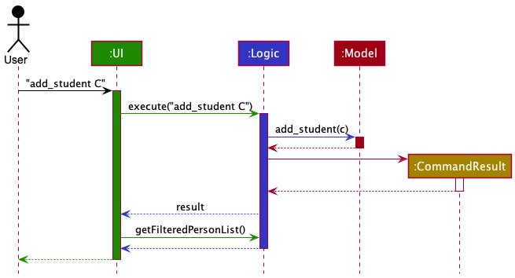

#### Design considerations:

**Aspect: How the person is handled in add_student:**

* **Alternative 1 (current choice):** Replace the original person with the student.
    * Pros: Easy to implement.
    * Cons: More checks needed to determine if handling a person or a student.

* **Alternative 2:** Create a separate student list and leave person untouched.
    * Pros: Fewer checks on whether person is a student required.
    * Cons: Additional filters required to remove duplicates when displaying both persons and students.

### Remove Student Feature

This `RemoveStudentCommand`feature is facilitated by the display students feature. It extends the application by
implementing the following operations:

* `RemoveStudentCommand#execute()` - Find corresponding `Student` and set it to a `Person`.

The operation is facilitated by the `Model` interface using `Model#hasTutorialWithName()`,
`Model#tutorialHasStudentWithId()`, `Model#getStudentWithId()`, `Model#getFilteredPersonList()`,
`Model#removeStudent()`.

Given below are two example scenarios based on different command inputs and how the mechanism behaves at each step.

##### Scenario 1: `remove_student id/...`
Step 1. The user executes `remove_student id/...` command to remove a student. The `remove_student` command calls
`Model#getStudentWithId()` to retrieve the corresponding Student.

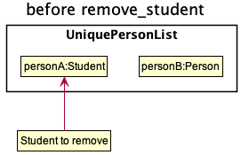

Step 2. The student is removed with `Model#removeStudent()` which extracts the fields of the Student object that are
relevant to create a new Person object, to replace the Student object.

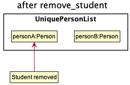

##### Scenario 2: `remove_student INDEX...`

Step 1. The user executes `list_student` command and the `DisplayListPanel` displays a list of all Students in the
application.

refer to [Display Students Feature](#display-students-feature) to see how the `list_student` command works.

Step 2. The user executes `remove_student INDEX...` command, where `INDEX` is the index of the desired student to be removed
in the current `DisplayListPanel`.

Step 3. The student to be removed is extracted from the list and removed using `Model#removeStudent()`.

**Note:** In both scenarios, validity checks are done with `Model#hasTutorialWithName()`,
`Model#tutorialHasStudentWithId()` and for scenario 2, additional checks are done to ensure index entered is not out of
bounds and that the desired index is referring to a Student object.

The following sequence diagram shows how this operation works:

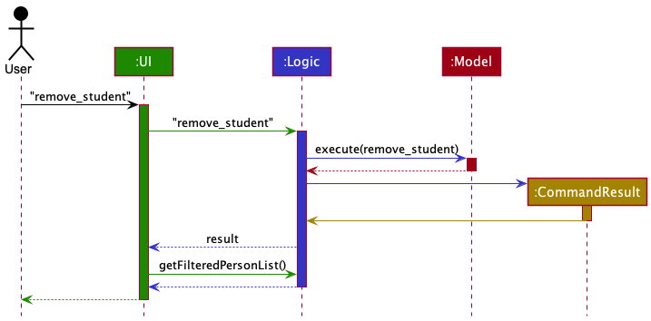

#### Design considerations:

##### Scenario 1: How the student is retrieved from the application
* **Alternative 1 (current choice):** model requests for Student object iteratively from the components in the Model component (i.e. calls AddressBook which calls UniqueTutorialList and so on )
  * Pros: Law of Demeter is followed and coupling between classes is decreased.
  * Cons: More code required.
* **Alternative 2:** model access request for the Tutorial object and retrieves Student object directly from Tutorial.
  * Pros: Easier to implement because fewer methods are needed to go through each component.
  * Cons: Increased coupling between classes.

##### Scenario 2: How the student is retrieved from the application
* **Current choice:** Direct access from `filteredPersonList()`
  * Pros: Easiest way to access a Student from a filtered list using index.
  * Cons: Increases coupling within classes. Currently, have no other solution to decrease coupling.

### \[Proposed\] Undo/redo feature

#### Proposed Implementation

The proposed undo/redo mechanism is facilitated by `VersionedAddressBook`. It extends `AddressBook` with an undo/redo history, stored internally as an `addressBookStateList` and `currentStatePointer`. Additionally, it implements the following operations:

* `VersionedAddressBook#commit()` — Saves the current address book state in its history.
* `VersionedAddressBook#undo()` — Restores the previous address book state from its history.
* `VersionedAddressBook#redo()` — Restores a previously undone address book state from its history.

These operations are exposed in the `Model` interface as `Model#commitAddressBook()`, `Model#undoAddressBook()` and `Model#redoAddressBook()` respectively.

Given below is an example usage scenario and how the undo/redo mechanism behaves at each step.

Step 1. The user launches the application for the first time. The `VersionedAddressBook` will be initialized with the initial address book state, and the `currentStatePointer` pointing to that single address book state.

Step 2. The user executes `delete 5` command to delete the 5th person in the address book. The `delete` command calls `Model#commitAddressBook()`, causing the modified state of the address book after the `delete 5` command executes to be saved in the `addressBookStateList`, and the `currentStatePointer` is shifted to the newly inserted address book state.

Step 3. The user executes `add n/David …` to add a new person. The `add` command also calls `Model#commitAddressBook()`, causing another modified address book state to be saved into the `addressBookStateList`.

:information_source: **Note:** If a command fails its execution, it will not call `Model#commitAddressBook()`, so the address book state will not be saved into the `addressBookStateList`.

Step 4. The user now decides that adding the person was a mistake, and decides to undo that action by executing the `undo` command. The `undo` command will call `Model#undoAddressBook()`, which will shift the `currentStatePointer` once to the left, pointing it to the previous address book state, and restores the address book to that state.

:information_source: **Note:** If the `currentStatePointer` is at index 0, pointing to the initial AddressBook state, then there are no previous AddressBook states to restore. The `undo` command uses `Model#canUndoAddressBook()` to check if this is the case. If so, it will return an error to the user rather
than attempting to perform the undo.

The following sequence diagram shows how the undo operation works:

:information_source: **Note:** The lifeline for `UndoCommand` should end at the destroy marker (X) but due to a limitation of PlantUML, the lifeline reaches the end of diagram.

The `redo` command does the opposite — it calls `Model#redoAddressBook()`, which shifts the `currentStatePointer` once to the right, pointing to the previously undone state, and restores the address book to that state.

:information_source: **Note:** If the `currentStatePointer` is at index `addressBookStateList.size() - 1`, pointing to the latest address book state, then there are no undone AddressBook states to restore. The `redo` command uses `Model#canRedoAddressBook()` to check if this is the case. If so, it will return an error to the user rather than attempting to perform the redo.

Step 5. The user then decides to execute the command `list`. Commands that do not modify the address book, such as `list`, will usually not call `Model#commitAddressBook()`, `Model#undoAddressBook()` or `Model#redoAddressBook()`. Thus, the `addressBookStateList` remains unchanged.

Step 6. The user executes `clear`, which calls `Model#commitAddressBook()`. Since the `currentStatePointer` is not pointing at the end of the `addressBookStateList`, all address book states after the `currentStatePointer` will be purged. Reason: It no longer makes sense to redo the `add n/David …​` command. This is the behavior that most modern desktop applications follow.

The following activity diagram summarizes what happens when a user executes a new command:

#### Design considerations:

**Aspect: How undo & redo executes:**

* **Alternative 1 (current choice):** Saves the entire address book.
  * Pros: Easy to implement.
  * Cons: May have performance issues in terms of memory usage.

* **Alternative 2:** Individual command knows how to undo/redo by
  itself.
  * Pros: Will use less memory (e.g. for `delete`, just save the person being deleted).
  * Cons: We must ensure that the implementation of each individual command are correct.

--------------------------------------------------------------------------------------------------------------------

## **Documentation, logging, testing, configuration, dev-ops**

* [Documentation guide](Documentation.md)
* [Testing guide](Testing.md)
* [Logging guide](Logging.md)
* [Configuration guide](Configuration.md)
* [DevOps guide](DevOps.md)

--------------------------------------------------------------------------------------------------------------------

## **Appendix: Requirements**

### Product scope

**Target user profile**:

* has a need to manage a significant number of contacts.
* prefer desktop apps over other types.
* can type fast.
* prefers typing to mouse interactions.
* is reasonably comfortable using CLI apps.
* TAs of modules that require class participation, and/or have regular submissions.

**Value proposition**:
* provides TAs a systematic and convenient way to manage assessments and class participation among students based on their contacts.

### User stories

Priorities: High (must have) - `* * *`, Medium (nice to have) - `* *`, Low (unlikely to have) - `*`

| No. | Priority | As a                                                | I can                                                                                                                          | So that I can                                                                                                        |
|-----|----------|-----------------------------------------------------|--------------------------------------------------------------------------------------------------------------------------------|----------------------------------------------------------------------------------------------------------------------|
| 1   | `*`      | potential user who just launched the app to explore | see a brief instruction to guide me on getting started with the app                                                            | know what I can do in the app.                                                                                       |
| 2   | `*`      | beginner user                                       | see sample classes on my list                                                                                                  | try out the features without adding my own classes first.                                                            |
| 3   | `***`    | forgetful beginner user                             | see a help manual with the list of commands available                                                                          | refer to them to use the command I need.                                                                             |
| 4   | `***`    | beginner user                                       | add classes to the list                                                                                                        | have an organized list of classes under my charge.                                                                   |
| 5   | `***`    | beginner user                                       | remove classes from the list of classes                                                                                        | so that I can delete any unavailable classes after the semester have ended                                           |
| 6   | `***`    | beginner user                                       | add the contacts of my students to their respective classes                                                                    | have a list of the students in each of my classes.                                                                   |
| 7   | `***`    | beginner user                                       | remove any contact from a class or a module                                                                                    |                                                                                                                      |
| 8   | `***`    | beginner user                                       | edit the details of each student in a particular class                                                                         | quickly update or correct the student’s details.                                                                     |
| 9   | `***`    | beginner user                                       | search for and view each student’s contact based on their name                                                                 | easily contact them when needed.                                                                                     |
| 10  | `***`    | beginner user                                       | view the list of the classes added with their basic information                                                                | refer to the classes that I am in charge of.                                                                         |
| 11  | `***`    | beginner user                                       | see the list of students in my classes                                                                                         | so that I can keep track which student has been added into my classes.                                               |
| 12  | `**`     | beginner user                                       | view class details and statistics                                                                                              | manage my class                                                                                                      |
| 13  | `***`    | beginner user                                       | add the module’s assessment components and their details (e.g. type, scale, deadline, etc.)                                    | keep track of my students’ performance for each component.                                                           |
| 14  | `***`    | beginner user                                       | delete an assessment component                                                                                                 | remove irrelevant assessment components                                                                              |
| 15  | `*`      | beginner user                                       | edit the details of an assessment component such as weightage                                                                  | quickly update or correct the information about the component.                                                       |
| 16  | `**`     | beginner user                                       | view a student’s performance in the assessment components                                                                      | know how the student has performed in the components.                                                                |
| 17  | `*`      | beginner user                                       | make notes relevant to a particular student.                                                                                   | keep track of any miscellaneous information about the student.                                                       |
| 18  | `*`      | expert user                                         | create shortcuts to classes                                                                                                    | save time on frequently visited classes.                                                                             |
| 19  | `*`      | expert user                                         | mark attendance for multiple students at once                                                                                  | quickly mark the attendance of a group of students.                                                                  |
| 20  | `*`      | expert user                                         | quickly update a student’s participation score during class                                                                    | save the time spent marking participation after class.                                                               |
| 21  | `*`      | expert user                                         | view details and statistics of different classes at the same time                                                              | To facilitate comparison of class performance and save time spent on accessing the details of each class one by one. |
| 22  | `*`      | expert user                                         | create aliases for commands                                                                                                    | save time spent on typing frequently used commands                                                                   |
| 23  | `*`      | TA                                                  | receive reminder for my upcoming classes when I open the app                                                                   | have an overview of my schedule.                                                                                     |
| 24  | `*`      | TA                                                  | filter students by assignment completion                                                                                       | send reminders to those who have not submitted.                                                                      |
| 25  | `*`      | TA                                                  | receive notifications of students who did not attend tutorial                                                                  | proceed with a follow-up action.                                                                                     |
| 26  | `*`      | TA                                                  | filter students who do not / barely meet minimum attendance rate                                                               | send them a reminder to attend the lessons.                                                                          |
| 27  | `*`      | TA                                                  | save overall class participation, assignment submission and assignment grades of a particular class in a separate storage file | retrieve each class’s collated statistics to be used in end of semester TA evaluation and reflection.                |
| 28  | `*`      | TA                                                  | choose a backup file to restore statistics from                                                                                | manage my classes on different computers when traveling.                                                             |
| 29  | `*`      | TA                                                  | receive reminders for checking of submission of assignments on the assignment due date                                         | consistently update if students have submitted their assignment on time.                                             |
| 30  | `*`      | TA                                                  | randomly generate a name from a specified class of a module                                                                    | facilitate class participation where TA can call a random student to answer a question.                              |
| 31  | `*`      | TA                                                  | save to do list for a specific lesson, notes for each lesson will be cleared after one week                                    | facilitate tutoring, so that TA can keep track of important tasks to clear during that week’s lesson.                |
| 32  | `*`      | TA                                                  | resize the application window                                                                                                  | avoid disruptions of switching between windows and tutorial documents during class.                                  |
| 33  | `*`      | TA                                                  | group a specified number of students in a class together randomly.                                                             | assign project groups quickly.                                                                                       |

### Use cases

(For all use cases below, the **System** is `camNUS` and the **Actor** is the `user`, unless specified otherwise)

**Use case: Delete a person**

**MSS**

1.  User requests to list persons.
2.  camNUS shows a list of persons.
3.  User requests to delete a specific person in the list.
4.  camNUS deletes the person. 

    Use case ends.

**Extensions**

* 2a. The list is empty.

  Use case ends.

* 3a. The given index is invalid.

    * 3a1. camNUS shows an error message.

      Use case resumes at step 2.
    
**Use Case: Update a student's result for an assessment**

**MSS**
1. camNUS shows a list of persons.
2. User requests to list all students in a class.
3. camNUS shows a list of students.
4. User requests to update the score of a student in an assessment component.
5. camNUS updates the student's score for the assessment component.

    Use case ends.

**Extensions**

* 2a. No class with given TUTORIAL_NAME exists in camNUS.

    * 2a1. camNUS shows an error message.

      Use case resumes at step 1.

* 4a. No assessment component with the given assessment name exists in camNUS.

    * 4a1. camNUS shows an error message.

      Use case resumes at step 3.

* 4b. No student with the given name exists in camNUS.

    * 4b1. camNUS shows an error message.

      Use case resumes at step 3.

* 4c. The given score is invalid

    * 4c1. camNUS shows an error message.

      Use case resumes at step 3.

**Use case: Edit a person**

**MSS**
1. User requests to list persons.
2. camNUS shows a list of persons.
3. User requests to edit a specific person in the list and provides the field(s) they want to update.
4. camNUS updates the existing values to the input values.

  Use case ends.

**Extensions**

* 2a. The list is empty.

  Use case ends.

* 3a. The given index is invalid.

    * 3a1. camNUS shows an error message.

      Use case resumes at step 2.

* 3b. No fields are provided.

    * 3b1. camNUS shows an error message.

      Use case resumes at step 2.

* 3c. No value is provided for a field that is not tags.

    * 3c1. camNUS shows an error message.

      Use case resumes at step 2.

* 4a. The user enters values for tags.

    * 4a1. Existing tags are removed and inputted tags are added to the person.

* 4b. No value is entered after t/.

  * 4b1. Existing tags are removed from the person.

### Non-Functional Requirements

1. Should work on any _mainstream OS_ as long as it has Java `11` or above installed.
2. Should be able to hold up to 1000 persons without a noticeable sluggishness in performance for typical usage.
3. A TA with above average typing speed for regular English text (i.e. not code, not system admin commands) should be able to accomplish most of the tasks faster using text commands than using the mouse.

### Glossary

* **Mainstream OS**: Windows, Linux, Unix, OS-X
* **Private contact detail**: A contact detail that is not meant to be shared with others

--------------------------------------------------------------------------------------------------------------------

## **Appendix: Instructions for manual testing**

Given below are instructions to test the app manually.

:information_source: **Note:** These instructions only provide a starting point for testers to work on;
testers are expected to do more *exploratory* testing.

### Launch and shutdown

1. Initial launch

   1. Download the jar file and copy into an empty folder

   1. Double-click the jar file Expected: Shows the GUI with a set of sample contacts. The window size may not be optimum.

1. Saving window preferences

   1. Resize the window to an optimum size. Move the window to a different location. Close the window.

   1. Re-launch the app by double-clicking the jar file. 
       Expected: The most recent window size and location is retained.

### Deleting a person

1. Deleting a person while all persons are being shown

   1. Prerequisites: List all persons using the `list` command. Multiple persons in the list.

   1. Test case: `delete 1` 
      Expected: First contact is deleted from the list. Details of the deleted contact shown in the status message. Timestamp in the status bar is updated.

   1. Test case: `delete 0` 
      Expected: No person is deleted. Error details shown in the status message. Status bar remains the same.

   1. Other incorrect delete commands to try: `delete`, `delete x`, `...` (where x is larger than the list size) 
      Expected: Similar to previous.

### Saving data

1. Dealing with missing/corrupted data files

2. Stop The Application By Closing the Program File

3. Delete all the files in the data folder, which is in the same directory as `camNUS.jar`

4. Start running `camNUS.jar`
   
